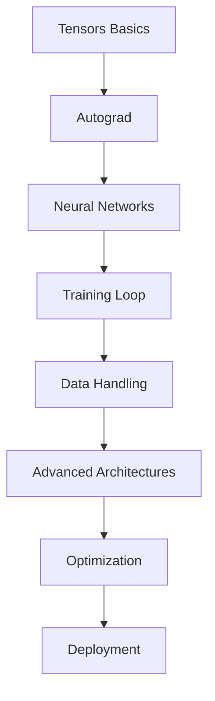

# PyTorch Cheatsheet - Complete Guide

A comprehensive, one-stop solution for learning PyTorch from basics to advanced concepts. This guide provides detailed explanations, practical examples, and best practices for mastering PyTorch.

## 📚 Table of Contents

### Part 1: Fundamentals
1. [Introduction & Installation](01-introduction.md)
2. [Tensors Basics](02-tensors-basics.md)
3. [Tensor Operations](03-tensor-operations.md)
4. [Autograd & Gradients](04-autograd.md)

### Part 2: Neural Networks
5. [Building Neural Networks](05-neural-networks.md)
6. [Loss Functions](06-loss-functions.md)
7. [Optimizers](07-optimizers.md)
8. [Training Loop](08-training-loop.md)

### Part 3: Data Handling
9. [Datasets & DataLoaders](09-datasets-dataloaders.md)
10. [Data Transformations](10-data-transformations.md)
11. [Custom Datasets](11-custom-datasets.md)

### Part 4: Advanced Topics
12. [Convolutional Neural Networks (CNNs)](12-cnns.md)
13. [Recurrent Neural Networks (RNNs)](13-rnns.md)
14. [Transfer Learning](14-transfer-learning.md)
15. [Model Saving & Loading](15-model-saving.md)

### Part 5: Optimization & Debugging
16. [GPU Acceleration](16-gpu-acceleration.md)
17. [Mixed Precision Training](17-mixed-precision.md)
18. [Debugging & Visualization](18-debugging.md)

### Part 6: Production & Deployment
19. [Model Deployment](19-deployment.md)
20. [Best Practices](20-best-practices.md)

## 🎯 How to Use This Guide

- **Beginners**: Start from Part 1 and progress sequentially
- **Intermediate**: Jump to specific topics you need to reinforce
- **Advanced**: Use as a quick reference for syntax and best practices

## 🔗 Quick Reference Cards

- [Common Operations Quick Reference](quick-reference.md)
- [Debugging Checklist](debugging-checklist.md)
- [Performance Optimization Tips](performance-tips.md)

## 💡 Learning Path

---

*Last Updated: November 2025*
